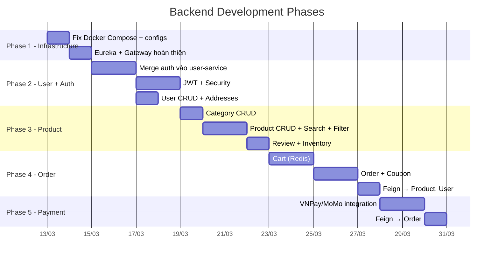
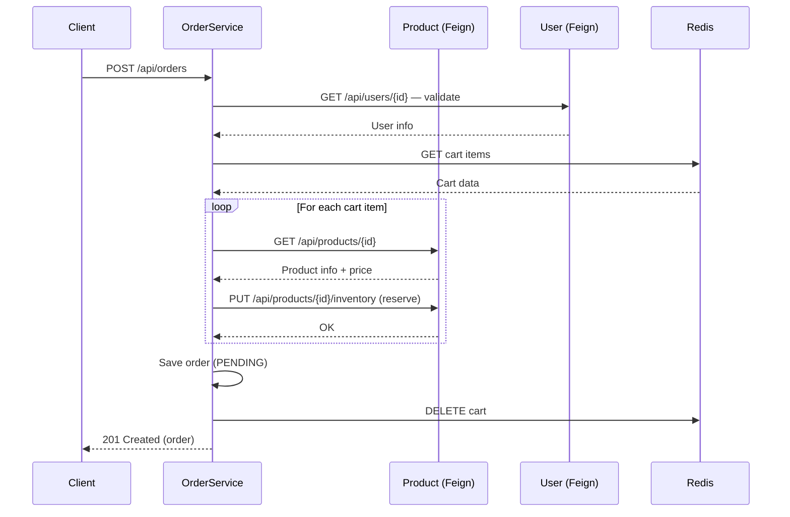
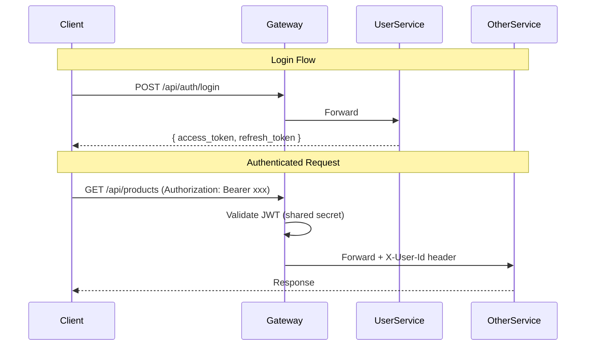

# Implementation Plan: Backend Microservices — Hệ thống TMĐT Linh kiện Máy tính

## Tổng quan

Xây dựng backend hoàn chỉnh cho hệ thống TMĐT linh kiện máy tính theo kiến trúc microservices. **Chưa triển khai AI Service** — tập trung vào 4 business services + infrastructure.

### Hiện trạng

| Module | Trạng thái |
|---|---|
| `eureka-service` | ✅ Bootstrap (Application class + application.yaml) |
| `api-gateway` | ✅ Bootstrap + [GatewayConfig.java](file:///c:/Users/ScarIet/Desktop/CNLTHD/sgu-cnlthd26k2-nhom07/backend/api-gateway/src/main/java/com/pcshop/api_gateway/config/GatewayConfig.java) |
| `auth-service` | ⬜ Empty bootstrap |
| `user-service` | 🟡 Basic CRUD (User model thiếu nhiều fields, chưa có auth/address) |
| `product-service` | ⬜ Empty bootstrap |
| `order-service` | ⬜ Empty bootstrap |
| `payment-service` | ⬜ Empty bootstrap |

### Tech Stack

- **Java 21** + **Spring Boot 4.0.3** + **Spring Cloud 2025.1.0**
- **MongoDB** (per-service DB) + **Redis** (Cart cache)
- **Spring Cloud Netflix Eureka** (Service Discovery)
- **Spring Cloud Gateway** (API Gateway)
- **OpenFeign** (Inter-service REST calls)
- **Spring Security + JWT** (Authentication)
- **Lombok** + **MapStruct** (Boilerplate reduction)

---

## Proposed Changes

> [!IMPORTANT]
> Plan này **KHÔNG** bao gồm AI Service. Sẽ triển khai trong phase riêng sau.

### Phân chia phases triển khai



---

## Phase 1 — Infrastructure Foundation

### Mục tiêu
Chuẩn bị hạ tầng chung: MongoDB, Redis, Eureka, API Gateway, Docker Compose hoàn chỉnh.

---

#### [MODIFY] [docker-compose.yml](file:///c:/Users/ScarIet/Desktop/CNLTHD/sgu-cnlthd26k2-nhom07/backend/docker-compose.yml)

Cập nhật Docker Compose hoàn chỉnh với **MongoDB**, **Redis**, health checks, depends_on điều kiện:

```yaml
services:
  mongodb:
    image: mongo:7
    ports: ["27017:27017"]
    volumes: [mongo_data:/data/db]
    healthcheck:
      test: ["CMD", "mongosh", "--eval", "db.adminCommand('ping')"]

  redis:
    image: redis:7-alpine
    ports: ["6379:6379"]
    healthcheck:
      test: ["CMD", "redis-cli", "ping"]

  eureka-service:
    build: ./eureka-service
    ports: ["8761:8761"]

  api-gateway:
    build: ./api-gateway
    ports: ["8080:8080"]
    depends_on:
      eureka-service: { condition: service_started }

  user-service:   # port 8081, depends: mongodb, eureka
  product-service: # port 8082, depends: mongodb, eureka
  order-service:  # port 8083, depends: mongodb, redis, eureka
  payment-service: # port 8084, depends: mongodb, eureka
```

---

#### [MODIFY] [application.yaml](file:///c:/Users/ScarIet/Desktop/CNLTHD/sgu-cnlthd26k2-nhom07/backend/eureka-service/src/main/resources/application.yaml)

Eureka Server config — xác nhận config chuẩn (tắt self-registration, self-preservation).

---

#### [MODIFY] [application.yaml](file:///c:/Users/ScarIet/Desktop/CNLTHD/sgu-cnlthd26k2-nhom07/backend/api-gateway/src/main/resources/application.yaml)

API Gateway config — routes cho 4 business services, CORS config cho frontend.

---

#### [NEW] Shared DTO library (`common-dto` module) — **Tùy chọn**

> [!NOTE]
> Có thể tạo module `common-dto` chứa shared DTOs (ApiResponse, PageResponse, ErrorResponse) hoặc duplicate nhỏ ở mỗi service. **Đề xuất:** duplicate nhỏ để giữ service independence.

---

## Phase 2 — User Service + Authentication

### Mục tiêu
Hoàn thiện User Service bao gồm: đăng ký, đăng nhập JWT, quản lý profile, quản lý địa chỉ, admin user management.

> [!IMPORTANT]
> **Gộp `auth-service` vào `user-service`** — authentication gắn chặt với user data, tách riêng gây complexity không cần thiết. Xóa module `auth-service`.

### Cấu trúc package `user-service`

```
com.pcshop.user_service/
├── config/
│   ├── SecurityConfig.java         # Spring Security + JWT filter chain
│   ├── JwtProperties.java          # JWT secret, expiration config
│   └── MongoConfig.java            # Auditing, indexes
├── security/
│   ├── JwtTokenProvider.java       # Generate / validate JWT
│   ├── JwtAuthenticationFilter.java # OncePerRequestFilter
│   └── UserPrincipal.java          # UserDetails implementation
├── model/
│   ├── Account.java                # @Document — full schema theo docs
│   ├── Address.java                # Embedded subdocument
│   └── RefreshToken.java           # @Document — refresh tokens
├── dto/
│   ├── request/
│   │   ├── RegisterRequest.java
│   │   ├── LoginRequest.java
│   │   ├── UpdateProfileRequest.java
│   │   └── AddressRequest.java
│   └── response/
│       ├── AuthResponse.java       # access_token + refresh_token
│       ├── UserResponse.java
│       └── ApiResponse.java        # Wrapper { success, message, data }
├── repository/
│   ├── AccountRepository.java
│   └── RefreshTokenRepository.java
├── service/
│   ├── AuthService.java            # register, login, refresh, logout
│   └── UserService.java            # profile, addresses, admin ops
├── controller/
│   ├── AuthController.java         # /api/auth/**
│   └── UserController.java         # /api/users/**
├── exception/
│   ├── GlobalExceptionHandler.java # @ControllerAdvice
│   ├── ResourceNotFoundException.java
│   ├── BadRequestException.java
│   └── UnauthorizedException.java
└── mapper/
    └── UserMapper.java             # MapStruct: Entity ↔ DTO
```

### API Endpoints (theo tài liệu kiến trúc)

| Method | Path | Auth | Mô tả |
|---|---|---|---|
| `POST` | `/api/auth/register` | Public | Đăng ký |
| `POST` | `/api/auth/login` | Public | Đăng nhập → JWT |
| `POST` | `/api/auth/refresh` | Public | Refresh token |
| `POST` | `/api/auth/logout` | Authenticated | Đăng xuất |
| `GET` | `/api/users/me` | Authenticated | Profile |
| `PUT` | `/api/users/me` | Authenticated | Cập nhật profile |
| `POST` | `/api/users/me/addresses` | Authenticated | Thêm địa chỉ |
| `PUT` | `/api/users/me/addresses/{id}` | Authenticated | Sửa địa chỉ |
| `DELETE` | `/api/users/me/addresses/{id}` | Authenticated | Xóa địa chỉ |
| `GET` | `/api/users` | ADMIN | Danh sách users |
| `GET` | `/api/users/{id}` | INTERNAL | User info (Feign) |
| `PUT` | `/api/users/{id}/status` | ADMIN | Đổi trạng thái |

### Dependencies cần thêm vào [pom.xml](file:///c:/Users/ScarIet/Desktop/CNLTHD/sgu-cnlthd26k2-nhom07/backend/user-service/pom.xml)

```xml
<!-- Thay thế spring-boot-starter-data-jpa bằng spring-boot-starter-data-mongodb -->
<dependency>spring-boot-starter-data-mongodb</dependency>
<dependency>spring-boot-starter-security</dependency>
<dependency>spring-boot-starter-validation</dependency>
<dependency>jjwt-api + jjwt-impl + jjwt-jackson (io.jsonwebtoken 0.12.x)</dependency>
<dependency>spring-cloud-starter-netflix-eureka-client</dependency> <!-- Thay eureka-server! -->
<dependency>mapstruct + mapstruct-processor</dependency>
```

> [!WARNING]
> Hiện tại [pom.xml](file:///c:/Users/ScarIet/Desktop/CNLTHD/sgu-cnlthd26k2-nhom07/backend/user-service/pom.xml) dùng `spring-boot-starter-data-jpa` (JPA) thay vì `spring-boot-starter-data-mongodb`. Cần fix lại. Cũng đang import `eureka-server` thay vì `eureka-client`.

---

## Phase 3 — Product Service

### Mục tiêu
CRUD sản phẩm, danh mục, đánh giá, quản lý tồn kho, tìm kiếm và lọc.

### Cấu trúc package `product-service`

```
com.pcshop.product_service/
├── config/
│   ├── SecurityConfig.java         # Validate JWT (stateless, share secret)
│   └── MongoConfig.java
├── model/
│   ├── Category.java               # categories collection
│   ├── Subcategory.java            # Embedded in Category
│   ├── Product.java                # products collection
│   ├── ProductImage.java           # Embedded
│   ├── ProductSpec.java            # Embedded
│   ├── Inventory.java              # Embedded
│   └── Review.java                 # reviews collection
├── dto/
│   ├── request/
│   │   ├── CategoryRequest.java
│   │   ├── ProductRequest.java
│   │   ├── ProductFilterRequest.java  # brand, category, price range, sort
│   │   ├── InventoryUpdateRequest.java
│   │   └── ReviewRequest.java
│   └── response/
│       ├── CategoryResponse.java
│       ├── ProductResponse.java
│       ├── ProductDetailResponse.java
│       ├── ReviewResponse.java
│       └── PageResponse.java
├── repository/
│   ├── CategoryRepository.java
│   ├── ProductRepository.java      # Custom query methods
│   └── ReviewRepository.java
├── service/
│   ├── CategoryService.java
│   ├── ProductService.java         # CRUD + search + filter + pagination
│   ├── ReviewService.java
│   └── InventoryService.java
├── controller/
│   ├── CategoryController.java     # /api/categories/**
│   ├── ProductController.java      # /api/products/**
│   └── ReviewController.java       # /api/reviews/**
├── feign/
│   └── OrderServiceClient.java     # Verify purchase for review
├── exception/
│   └── GlobalExceptionHandler.java
└── mapper/
    ├── CategoryMapper.java
    └── ProductMapper.java
```

### API Endpoints

| Method | Path | Auth | Mô tả |
|---|---|---|---|
| `GET` | `/api/categories` | Public | Danh sách danh mục |
| `POST` | `/api/categories` | ADMIN | Thêm danh mục |
| `GET` | `/api/products` | Public | Danh sách SP (filter, search, paging) |
| `GET` | `/api/products/{slug}` | Public | Chi tiết SP |
| `GET` | `/api/products/featured` | Public | SP nổi bật |
| `GET` | `/api/products/best-sellers` | Public | SP bán chạy |
| `POST` | `/api/products` | ADMIN | Thêm SP |
| `PUT` | `/api/products/{id}` | ADMIN | Sửa SP |
| `PUT` | `/api/products/{id}/inventory` | INTERNAL | Cập nhật tồn kho |
| `GET` | `/api/reviews/product/{productId}` | Public | Reviews của SP |
| `POST` | `/api/reviews` | Authenticated | Thêm đánh giá |

### Features đặc biệt
- **Full-text search** trên `name`, `brand`, `description` (MongoDB text index)
- **Filtering**: theo `category`, `brand`, `price range`, `is_featured`, `is_best_seller`
- **Sorting**: theo `price`, `rating`, `created_at`
- **Pagination**: `page`, `size` params → `PageResponse<ProductResponse>`
- **Inventory management**: reserve/release tồn kho (gọi từ Order Service qua Feign)

---

## Phase 4 — Order Service

### Mục tiêu
Giỏ hàng (Redis), đặt hàng, quản lý đơn hàng, mã giảm giá.

### Cấu trúc package `order-service`

```
com.pcshop.order_service/
├── config/
│   ├── SecurityConfig.java
│   ├── RedisConfig.java            # RedisTemplate, serialization
│   └── MongoConfig.java
├── model/
│   ├── Order.java                  # orders collection
│   ├── OrderItem.java              # Embedded
│   ├── OrderPayment.java           # Embedded
│   ├── OrderShipping.java          # Embedded
│   ├── OrderPricing.java           # Embedded
│   ├── StatusHistory.java          # Embedded
│   ├── Coupon.java                 # coupons collection
│   └── CartItem.java               # Redis model
├── dto/
│   ├── request/
│   │   ├── CartItemRequest.java
│   │   ├── CreateOrderRequest.java
│   │   ├── UpdateOrderStatusRequest.java
│   │   ├── CouponRequest.java
│   │   └── ValidateCouponRequest.java
│   └── response/
│       ├── CartResponse.java
│       ├── OrderResponse.java
│       ├── OrderDetailResponse.java
│       ├── CouponResponse.java
│       └── CouponValidationResponse.java
├── repository/
│   ├── OrderRepository.java
│   └── CouponRepository.java
├── service/
│   ├── CartService.java            # Redis-backed cart
│   ├── OrderService.java           # Create, update status, cancel
│   └── CouponService.java          # Validate, apply, admin CRUD
├── controller/
│   ├── CartController.java         # /api/cart/**
│   ├── OrderController.java        # /api/orders/**
│   └── CouponController.java       # /api/coupons/**
├── feign/
│   ├── ProductServiceClient.java   # Get product info, update inventory
│   └── UserServiceClient.java      # Validate user
├── exception/
│   └── GlobalExceptionHandler.java
└── mapper/
    └── OrderMapper.java
```

### API Endpoints

| Method | Path | Auth | Mô tả |
|---|---|---|---|
| `GET` | `/api/cart` | Authenticated | Xem giỏ hàng |
| `POST` | `/api/cart/items` | Authenticated | Thêm SP vào giỏ |
| `PUT` | `/api/cart/items/{productId}` | Authenticated | Cập nhật số lượng |
| `DELETE` | `/api/cart/items/{productId}` | Authenticated | Xóa SP |
| `DELETE` | `/api/cart` | Authenticated | Xóa giỏ hàng |
| `POST` | `/api/orders` | Authenticated | Tạo đơn hàng |
| `GET` | `/api/orders` | Authenticated | Đơn hàng của user |
| `GET` | `/api/orders/{id}` | Authenticated | Chi tiết đơn |
| `PUT` | `/api/orders/{id}/cancel` | Authenticated | Hủy đơn |
| `PUT` | `/api/orders/{id}/status` | ADMIN | Cập nhật trạng thái |
| `GET` | `/api/orders/admin` | ADMIN | Tất cả đơn hàng |
| `POST` | `/api/coupons/validate` | Authenticated | Kiểm tra coupon |
| `POST` | `/api/coupons` | ADMIN | Tạo coupon |
| `GET` | `/api/coupons` | ADMIN | Danh sách coupon |

### Luồng đặt hàng (Order Creation Flow)



### Dependencies cần thêm

```xml
<dependency>spring-boot-starter-data-redis</dependency>
<dependency>spring-cloud-starter-openfeign</dependency>
```

---

## Phase 5 — Payment Service

### Mục tiêu
Tích hợp cổng thanh toán (VNPay, MoMo), quản lý giao dịch, hoàn tiền.

### Cấu trúc package `payment-service`

```
com.pcshop.payment_service/
├── config/
│   ├── SecurityConfig.java
│   ├── VnPayConfig.java            # VNPay credentials
│   └── MomoConfig.java             # MoMo credentials
├── model/
│   ├── Payment.java                # payments collection
│   └── PaymentLog.java             # Embedded audit log
├── dto/
│   ├── request/
│   │   ├── InitiatePaymentRequest.java
│   │   └── RefundRequest.java
│   └── response/
│       ├── PaymentResponse.java
│       ├── PaymentUrlResponse.java
│       └── PaymentHistoryResponse.java
├── repository/
│   └── PaymentRepository.java
├── service/
│   ├── PaymentService.java         # Core logic
│   ├── VnPayService.java           # VNPay integration
│   └── MomoService.java            # MoMo integration
├── controller/
│   └── PaymentController.java      # /api/payments/**
├── feign/
│   └── OrderServiceClient.java     # Get/update order info
├── exception/
│   └── GlobalExceptionHandler.java
└── mapper/
    └── PaymentMapper.java
```

### API Endpoints

| Method | Path | Auth | Mô tả |
|---|---|---|---|
| `POST` | `/api/payments/{orderId}/initiate` | Authenticated | Khởi tạo thanh toán |
| `POST` | `/api/payments/callback/vnpay` | Public | VNPay callback |
| `POST` | `/api/payments/callback/momo` | Public | MoMo callback |
| `GET` | `/api/payments/{orderId}` | Authenticated | Trạng thái thanh toán |
| `POST` | `/api/payments/{orderId}/refund` | ADMIN | Hoàn tiền |
| `GET` | `/api/payments` | ADMIN | Lịch sử giao dịch |

---

## Cross-Cutting Concerns (áp dụng cho tất cả services)

### 1. Exception Handling Pattern

```java
@RestControllerAdvice
public class GlobalExceptionHandler {
    // ResourceNotFoundException → 404
    // BadRequestException → 400
    // UnauthorizedException → 401
    // AccessDeniedException → 403
    // MethodArgumentNotValidException → 400 (validation)
    // General Exception → 500
}
```

### 2. API Response Wrapper

```java
public class ApiResponse<T> {
    private boolean success;
    private String message;
    private T data;
    private LocalDateTime timestamp;
}
```

### 3. JWT Security Flow



> **JWT validation tại Gateway**: Gateway validate token và inject `X-User-Id`, `X-User-Role` headers. Downstream services trust headers từ Gateway mà không tự validate JWT.

### 4. Logging & Monitoring

- SLF4J + Logback cho mỗi service
- Request/Response logging filter
- Correlation ID truyền qua headers (`X-Correlation-Id`)

---

## Tóm tắt files cần tạo/sửa theo Phase

| Phase | Service | Files mới (ước tính) | Files sửa |
|---|---|---|---|
| 1 | Infrastructure | 0 | [docker-compose.yml](file:///c:/Users/ScarIet/Desktop/CNLTHD/sgu-cnlthd26k2-nhom07/backend/docker-compose.yml), 2 [application.yaml](file:///c:/Users/ScarIet/Desktop/CNLTHD/sgu-cnlthd26k2-nhom07/backend/user-service/src/main/resources/application.yaml) |
| 2 | user-service | ~20 files | [pom.xml](file:///c:/Users/ScarIet/Desktop/CNLTHD/sgu-cnlthd26k2-nhom07/backend/user-service/pom.xml), [User.java](file:///c:/Users/ScarIet/Desktop/CNLTHD/sgu-cnlthd26k2-nhom07/backend/user-service/src/main/java/com/pcshop/user_service/model/User.java) → `Account.java`, [application.yaml](file:///c:/Users/ScarIet/Desktop/CNLTHD/sgu-cnlthd26k2-nhom07/backend/user-service/src/main/resources/application.yaml) |
| 3 | product-service | ~22 files | [pom.xml](file:///c:/Users/ScarIet/Desktop/CNLTHD/sgu-cnlthd26k2-nhom07/backend/user-service/pom.xml), [application.yaml](file:///c:/Users/ScarIet/Desktop/CNLTHD/sgu-cnlthd26k2-nhom07/backend/user-service/src/main/resources/application.yaml) |
| 4 | order-service | ~24 files | [pom.xml](file:///c:/Users/ScarIet/Desktop/CNLTHD/sgu-cnlthd26k2-nhom07/backend/user-service/pom.xml), [application.yaml](file:///c:/Users/ScarIet/Desktop/CNLTHD/sgu-cnlthd26k2-nhom07/backend/user-service/src/main/resources/application.yaml) |
| 5 | payment-service | ~16 files | [pom.xml](file:///c:/Users/ScarIet/Desktop/CNLTHD/sgu-cnlthd26k2-nhom07/backend/user-service/pom.xml), [application.yaml](file:///c:/Users/ScarIet/Desktop/CNLTHD/sgu-cnlthd26k2-nhom07/backend/user-service/src/main/resources/application.yaml) |

---

## Verification Plan

### Automated Tests

#### Unit Tests (mỗi service)
- Service layer tests với **Mockito** mock repository
- Controller layer tests với **@WebMvcTest** + MockMvc
- JWT token generation/validation tests
- Chạy: `mvn test -pl user-service` (tương tự cho các service khác)

#### Integration Tests
- Repository tests với **@DataMongoTest** + Embedded MongoDB hoặc Testcontainers
- Feign Client tests với **WireMock**
- Redis integration test cho Cart Service
- Chạy: `mvn verify -pl order-service`

### Docker E2E Test

```bash
# Từ thư mục backend/
docker compose up --build -d

# Health checks
curl http://localhost:8761               # Eureka dashboard
curl http://localhost:8080/actuator/health # Gateway health

# Test User flow
curl -X POST http://localhost:8080/api/auth/register -H "Content-Type: application/json" \
  -d '{"username":"test","email":"test@test.com","password":"Test@123","name":"Test User"}'
curl -X POST http://localhost:8080/api/auth/login -H "Content-Type: application/json" \
  -d '{"username":"test","password":"Test@123"}'
# → Lưu access_token

# Test Product flow
curl http://localhost:8080/api/products
curl http://localhost:8080/api/categories

# Test Cart flow
curl -X POST http://localhost:8080/api/cart/items \
  -H "Authorization: Bearer {token}" \
  -H "Content-Type: application/json" \
  -d '{"productId":"...","quantity":1}'

# Test Order flow
curl -X POST http://localhost:8080/api/orders \
  -H "Authorization: Bearer {token}"
```

### Manual Verification
- Kiểm tra Eureka dashboard xem tất cả services đều registered
- Test qua **Postman collection** (sẽ tạo file `postman-collection.json`)
- Kiểm tra MongoDB data bằng MongoDB Compass

---

## User Review Required

> [!IMPORTANT]
> **Quyết định cần xác nhận:**
> 1. **Gộp `auth-service` vào `user-service`?** — Đề xuất gộp vì authentication gắn chặt với user data. Nếu muốn giữ tách riêng sẽ có thêm complexity Feign calls.
> 2. **JWT validation tại Gateway** — Gateway validate JWT và forward `X-User-Id`/`X-User-Role` headers? (thay vì mỗi service tự validate JWT)
> 3. **Bắt đầu từ Phase nào?** — Đề xuất theo thứ tự Phase 1 → 2 → 3 → 4 → 5
> 4. **Port mapping**: Theo docs hiện tại, `user-service` = 8081, `product-service` = 8082, `order-service` = 8083, `payment-service` = 8084. Xác nhận giữ nguyên?
